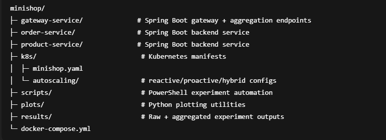

# MiniShop (Microservices + Gateway) — Master Thesis Demo & Autoscaling Testbed

MiniShop is a small **microservices-based** demo system built with **Spring Boot** and designed as a **minimal but complete testbed** for a Master’s thesis on **autoscaling strategies** for microservices on **Kubernetes**.

It provides:
- A simple **3-service architecture** (gateway + 2 backend services)
- A controlled **CPU workload generator** (`WorkSimulator`) to create predictable load
- A reproducible experimental setup for evaluating autoscaling strategies:
    - **baseline** (no autoscaling)
    - **reactive** (HPA)
    - **proactive** (scheduled / cron scaling)
    - **hybrid** (proactive + reactive)

---

## Contents

- [System Overview](#system-overview)
- [Architecture](#architecture)
- [Services & Endpoints](#services--endpoints)
- [Running the System](#running-the-system)
    - [Run Locally (non-Docker)](#run-locally-non-docker)
    - [Run with Docker Compose](#run-with-docker-compose)
- [Kubernetes & Autoscaling (Minikube)](#kubernetes--autoscaling-minikube)
- [Experiments & Reproducibility](#experiments--reproducibility)
    - [Workload Patterns](#workload-patterns)
    - [Metrics](#metrics)
    - [Run Pattern Experiments](#run-pattern-experiments)
    - [Extract → Aggregate → Plot](#extract--aggregate--plot)
    - [Check Completeness (No “Holes”)](#check-completeness-no-holes)
- [Results](#results)
- [Repository Structure](#repository-structure)
- [Scope & Limitations](#scope--limitations)
- [License](#license)

---

## System Overview

MiniShop contains three independent Spring Boot services:

- **product-service** — Products API
- **order-service** — Orders API
- **gateway-service** — Gateway / Aggregator API that calls the other services

The gateway aggregates responses from the backend services to demonstrate **service-to-service communication** typical in microservice architectures.

---

## Architecture

### High-Level Ports

- `product-service` runs on **port 8080**
- `order-service` runs on **port 8082**
- `gateway-service` runs on **port 8081**

### Communication

- The **gateway-service** calls product-service and order-service.
- In Docker, services talk via container DNS names.
- In Kubernetes, services talk via Kubernetes Service names.

---

## Services & Endpoints

### product-service
- `GET /products`

### order-service
- `GET /orders`

### gateway-service
- `GET /api/products` → forwards to product-service `/products`
- `GET /api/orders` → forwards to order-service `/orders`
- `GET /api/summary` → calls both services and returns one combined JSON response

---

## Requirements

### Run locally (non-Docker)
- Java **21+**
- Maven **or** Maven Wrapper (`./mvnw`)
- IntelliJ IDEA (optional)

### Run with Docker
- Docker Desktop
- Docker Compose v2

### Kubernetes experiments (Minikube)
- Minikube
- kubectl
- metrics-server addon enabled in Minikube (script does this automatically)

---

## Running the System

### Run Locally (non-Docker)

⚠️ **Important:**  
When running locally, you need **3 terminals** because the gateway depends on the other two services.

#### 1) Start product-service (Terminal 1)
```bash
cd product-service
./mvnw spring-boot:run
```
### Test:
- `http://localhost:8080/products`

####  2) Start order-service (Terminal 2)

```bash
cd order-service
./mvnw spring-boot:run
```
Test:

- `http://localhost:8082/orders`

#### 3) Start gateway-service (Terminal 3)
```bash
cd gateway-service
./mvnw spring-boot:run
```
Test gateway:

- `http://localhost:8081/api/products`

- `http://localhost:8081/api/orders`

- `http://localhost:8081/api/summary`

---


## Run with Docker Compose
Build JARs
```bash
cd product-service && ./mvnw clean package -DskipTests
cd ../order-service && ./mvnw clean package -DskipTests
cd ../gateway-service && ./mvnw clean package -DskipTests
cd ..
```
Start services
```bash
docker compose up --build
```
Test endpoints

- `http://localhost:8080/products`

- `http://localhost:8082/orders`

- `http://localhost:8081/api/products` 

- `http://localhost:8081/api/orders`

- `http://localhost:8081/api/summary`

Stop containers
```bash
docker compose down
```
---

Docker vs Localhost

Inside Docker:

- `http://product-service:8080`

- `http://order-service:8082`

Locally:

- `http://localhost:8080`

- `http://localhost:8082`

---

### Kubernetes & Autoscaling (Minikube)

This repository also contains Kubernetes manifests and autoscaling configurations used in the thesis experiments.

### Base Kubernetes manifest

k8s/minishop.yaml

### Autoscaling manifests

- `k8s/autoscaling/reactive-hpa.yaml` (reactive / HPA)

- `k8s/autoscaling/proactive-cron.yaml` (proactive / scheduled scaling)

- `k8s/autoscaling/hybrid-cron.yaml` (hybrid: scheduled + reactive)

- k8s/autoscaling/autoscaler-rbac-hpa.yaml` (RBAC for HPA components if needed)

---

### Experiments & Reproducibility
### Workload Patterns

Experiments use Fortio as load generator and execute workloads as patterns split into segments:

### DayNight pattern:

- `night_1` (low load)

- `day` (higher load)

- `night_2` (low load)

### Spike pattern:

- `low_1` (low load)

- `spike` (sudden high load)

- `low_2` (back to low load)

Scripts run each `(pattern, strategy)` combination with Reps = 3 repetitions for statistical stability.

---

### Metrics

Primary metrics used for evaluation:

- **avg latency (ms)** per run/segment

- **p99 latency (ms)** per run/segment (tail latency)

- **actual QPS**

- lus Kubernetes snapshots for debugging / context:

  - pods, deployments, HPA/CronJobs

  - `kubectl top pods`, `kubectl top nodes`

 ---

### Run Pattern Experiments

The main runner is:
```bash
.\scripts\run_patterns.ps1
```
Inside the script you can control:
Output is written under:
```bash
$Reps = 3
$PatternsToRun = @("spike","daynight")
$StrategiesToRun = @("baseline","reactive","proactive","hybrid")
```
Output is written under:
```bash
results/exp_patterns_minikube_v1/<pattern>/<strategy>/repX/
```
Each rep contains:

- `fortio_<segment>.json`

- `fortio_<segment>.describe.txt`

- `snapshots in metrics/`

 --- 

### Extract → Aggregate → Plot

After running experiments (or after filling missing reps), rebuild the analysis artifacts:

#### 1) Extract raw CSV from all JSON outputs
```bash
.\scripts\extract_fortio_results.ps1
```
This generates:

results/exp_patterns_minikube_v1/summary_fortio.csv

#### 2) Rebuild aggregated CSV (mean/std over reps)

- `Run your aggregation block (PowerShell) that writes`:

results/exp_patterns_minikube_v1/summary_fortio_agg.csv

#### 3) Generate plots
```bash
python .\plots\make_plots.py
```
Plots are written to:

- `results/plots_agg/`

 ---

### Check Completeness (No “Holes”)

The following should return an empty table once all `(pattern, strategy, segment)` have `reps = 3`:
```bash
$keep = @("spike","day","night_1","night_2","low_1","low_2")

Import-Csv .\results\exp_patterns_minikube_v1\summary_fortio_agg.csv |
Where-Object { $keep -contains $_.segment } |
Where-Object { [int]$_.reps -lt 3 } |
Sort-Object pattern,segment,strategy |
Format-Table -AutoSize pattern,segment,strategy,reps
```
Goal: no rows printed.

### Results
### Aggregated results (CSV)

- `results/exp_patterns_minikube_v1/summary_fortio_agg.csv`

Columns include:

- `avg_mean`, `avg_std`

- `p99_mean`, `p99_std`

- `qps_mean`, `qps_std`

- `reps`

### Plots

Generated plots are saved under:

- `results/plots_agg/`

Examples:

- `p99_daynight_day.png`

- `p99_spike_spike.png`

- `avg_daynight_night_2.png`

- `qps_spike_low_1.png`

### Repository Structure


### Scope & Limitations

This project intentionally keeps the system minimal to ensure controlled experiments:

Excluded:

- Databases / persistent storage

- Full CI/CD pipelines

- Production-grade observability stack

Included:

- Microservices communication

- Gateway pattern

- Docker Compose for local packaging

- Kubernetes deployment and autoscaling experiments (Minikube)

Limitations (important for thesis interpretation):

- Minikube is a single-node environment → results may differ from multi-node clusters

- Synthetic workloads (Fortio) do not fully represent real user traffic

- CPU-based signals and scheduled scaling cover common cases but not all possible autoscaling approaches
