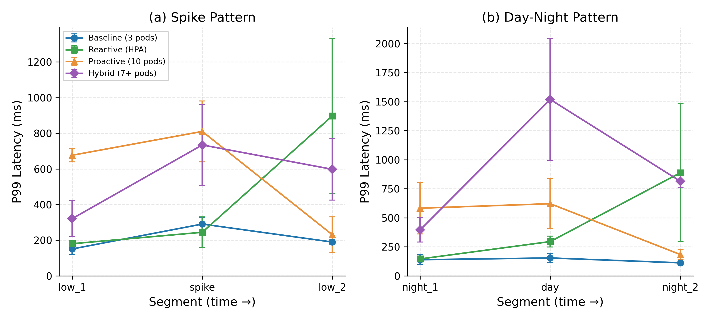
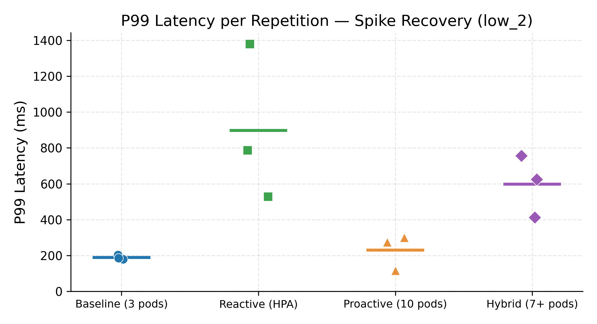
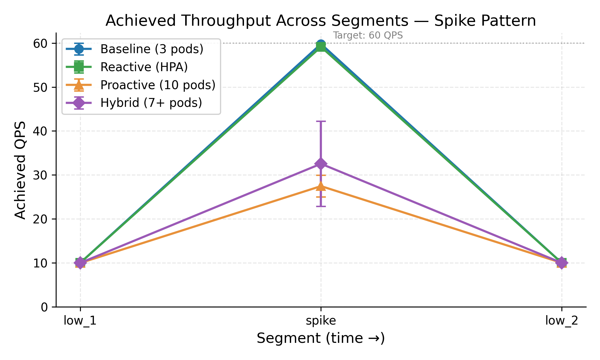

# MiniShop — Evaluating Autoscaling Strategies for Java Microservices on Kubernetes

> Reactive vs. Proactive vs. Hybrid — a controlled empirical comparison on single-node Kubernetes.

[]()
[]()
[]()
[]()

This repository contains the **MiniShop** testbed and experimental harness for my Master's thesis at HAWK Göttingen (2026): *Evaluating Autoscaling Strategies for Java Microservices on Kubernetes: Reactive vs. Proactive vs. Hybrid*.

MiniShop is a three-service Spring Boot application deployed on Kubernetes with a configurable CPU workload and a controlled experiment runner that compares four autoscaling conditions across two workload patterns, producing reproducible p99 tail-latency and throughput measurements at the gateway.

---

## TL;DR — Headline Finding

On a **single-node** Kubernetes cluster, **horizontal scaling beyond 3–4 pods degrades rather than improves performance**. The strategy ranking observed here is the reverse of what the multi-node literature reports:

> **Baseline ≈ Reactive  >  Proactive  >  Hybrid**

| Strategy | Pods during spike | P99 spike (ms) | Achieved QPS | Throughput loss |
|---|---|---|---|---|
| **Baseline** (fixed 3 pods) | 3 | **291** | **59.8 / 60** | 0.3% |
| **Reactive** (HPA) | 3–6 | 244 | 59.1 / 60 | 1.5% |
| Proactive (pre-scaled) | 10 | 810 | 27.5 / 60 | **54.2%** |
| Hybrid (floor + HPA) | 7–14 | 734 | 32.5 / 60 | **45.8%** |

The cause is **CPU contention**: on a single node, each additional JVM instance adds fixed runtime overhead that outweighs the load-distribution benefit. This finding is *infrastructure-dependent* — the same strategies would be expected to win on multi-node clusters where pods distribute across physical machines.

See [`results_report.md`](./results_report.md) for the full analysis and the thesis PDF for the complete discussion and literature context.

---

## Architecture

MiniShop is a gateway-based microservice chain. A single request to `GET /api/summary?work=2` triggers **two sequential downstream calls**, so the end-to-end response time at the gateway equals the sum of both downstream response times — making the gateway the correct measurement point for tail latency.

```
           ┌─────────────────────────────────────────────────────┐
           │  Kubernetes namespace: minishop                     │
           │                                                     │
  Fortio   │   ┌──────────┐        ┌────────────────┐            │
   ─────────► gateway   │ ──GET──►│ product-service│ :8080      │
  10/30/60 │   │ :8081    │        └────────────────┘            │
    QPS    │   │          │        ┌────────────────┐            │
           │   │          │ ──GET──►│ order-service  │ :8082     │
           │   └────┬─────┘        └────────────────┘            │
           │        │                                            │
           │        ▼                                            │
           │    p99 measured here                                │
           │                                                     │
           │   ┌──────────────┐                                  │
           │   │ HPA / script │   autoscaling controller         │
           │   │              │   CPU target: 60%                │
           │   └──────────────┘                                  │
           └─────────────────────────────────────────────────────┘
```

**Key design choices:**
- **Sequential call chain** — end-to-end latency is the *sum* of downstream latencies, so tail events compound.
- **Configurable CPU work** (`?work=2`) — each service burns ~2 ms of real CPU per request via a tight XOR loop, which is what lets the HPA actually trigger on CPU utilization.
- **Minimal business logic** — no DB, no external I/O, so latency differences reflect *autoscaling behavior*, not application variability.

---

## Repository Structure

```
.
├── gateway-service/          Spring Boot gateway (port 8081) — sequential downstream calls
├── product-service/          Spring Boot product service (port 8080)
├── order-service/            Spring Boot order service (port 8082)
├── k8s/
│   ├── minishop.yaml         Namespace, Deployments, Services, probes, resource limits
│   └── autoscaling/
│       ├── reactive-hpa.yaml         HPA for all 3 services (60% CPU target)
│       ├── proactive-cron.yaml       CronJob-based pre-scaling (legacy — see scripts)
│       ├── hybrid-cron.yaml          Hybrid floor via CronJob (legacy)
│       └── autoscaler-rbac-hpa.yaml  RBAC for dynamic HPA patching
├── scripts/
│   ├── run_patterns_v2.ps1         Main experiment runner (PowerShell)
│   ├── extract_fortio_v6.ps1       Fortio JSON → CSV
│   └── aggregate_fortio_v6.py      CSV → aggregated results
├── plots/
│   ├── make_thesis_plots.py        Generate all 7 thesis figures (Chapter 4)
│   ├── make_plots_v6.py            Per-segment bar/error-bar plots
│   └── make_plots.py               (legacy, v1 data)
├── results/
│   ├── exp_patterns_minikube_v6/   Canonical thesis results (24 runs)
│   │   ├── spike/{baseline,reactive,proactive,hybrid}/rep{1,2,3}/
│   │   ├── daynight/{baseline,reactive,proactive,hybrid}/rep{1,2,3}/
│   │   ├── summary_fortio.csv        Per-segment raw results
│   │   └── summary_fortio_agg.csv    Aggregated mean ± std
│   └── thesis_plots/               Figures for the thesis (generated)
├── docker-compose.yml              Local dev: all 3 services without Kubernetes
├── results_report.md               Full results analysis
└── README.md                       This file
```

**Note:** Earlier experiment iterations (`exp_patterns_minikube_v1`–`v5`, `exp_matrix_minikube_v1`, various `hybrid_*` folders) are kept for traceability but are not referenced by the thesis. The canonical dataset is `exp_patterns_minikube_v6`.

---

## Experimental Design

### Four autoscaling conditions

| Condition | Mechanism | Pods at rest | Pods under peak load |
|---|---|---|---|
| **Baseline** | No autoscaling, fixed replicas | 3 (1+1+1) | 3 |
| **Reactive** | Kubernetes HPA, CPU target 60% | 3 | 3–6 (HPA-driven) |
| **Proactive** | Script-triggered `kubectl scale` | 3 | 10 (4+3+3, pre-scaled) |
| **Hybrid** | HPA + dynamic `minReplicas` floor | 3 | 7–14 (floor 3+2+2 + HPA on top) |

### Two workload patterns

| Pattern | Segment 1 | Segment 2 (load) | Segment 3 | Purpose |
|---|---|---|---|---|
| **Spike** | 10 QPS × 60 s | **60 QPS × 30 s** (6× jump) | 10 QPS × 60 s | Tests the HPA reaction gap under abrupt load |
| **Day-night** | 10 QPS × 60 s | **30 QPS × 90 s** (3× jump) | 10 QPS × 60 s | Tests scale-down penalty under gradual load |

### Configuration

- **Resource limits:** CPU request `100m`, limit `500m` per pod; memory `128Mi`/`512Mi`
- **HPA:** target 60% CPU utilization, scale-up stabilization `0s`, scale-down stabilization `300s` (Kubernetes default)
- **Load generator:** Fortio 1.63.0, concurrency 10, inside the cluster
- **Repetitions:** 3 per (strategy × pattern × segment) — 24 runs total
- **Warmup:** 10 s at 10 QPS before each measurement (follows Georges et al. recommendation)

---

## Results

All plots below are generated by `plots/make_thesis_plots.py` from `summary_fortio_agg.csv` and `summary_fortio.csv`.

### P99 tail latency — both patterns



**Observation:** Under the abrupt spike, baseline and reactive handle the load in sub-300 ms p99. Proactive and hybrid — despite having 10+ pre-scaled pods ready — produce 2.8×–3× worse p99 because of CPU contention on the single node. Reactive then pays its scale-down penalty during recovery: p99 rises to **898 ms** (4.7× baseline) because the 300-second HPA stabilization window keeps excess pods on the shared node.

Under the gradual day-night pattern, hybrid produces the worst single measurement of the entire experiment (**p99 = 1,518 ms** during the day segment, 10× baseline) because its dynamic minReplicas floor plus HPA reactive additions on top compound into maximum contention.

### Per-repetition variance during recovery



The scale-down penalty has high run-to-run variance: reactive repetitions range from ~530 ms to ~1380 ms depending on exactly when the HPA stabilization window expires relative to the measurement interval.

### Throughput saturation under spike



**Observation:** At 60 QPS target, proactive achieves only 27.5 QPS and hybrid only 32.5 QPS — **not because requests fail** (HTTP errors are ≤0.1% across all 24 runs) but because response times rise high enough that Fortio cannot complete 60 requests/second within the segment duration.

### The efficiency inversion

| Strategy | Resource cost (replica-seconds) | vs. baseline | P99 during load |
|---|---|---|---|
| Baseline | 450 | 1.0× | **best** |
| Reactive | ~540–660 | ~1.3× | near-best |
| Hybrid | ~630–1,050 | ~1.8× | worst |
| Proactive | 1,080 | **2.4×** | second-worst |

The strategies that consume the most resources produce the worst performance — an inversion specific to single-node infrastructure.

---

## Reproducing the Experiment

### Prerequisites

- **Windows 10/11** with PowerShell 5.1+
- **Docker Desktop** (for the Minikube driver)
- **Minikube** v1.37+, **kubectl** v1.34+
- **Java 21 (LTS)**, **Maven 3.9+** (for building service images)
- **Python 3.10+** with `pandas`, `matplotlib`, `numpy` (for aggregation and plots)
- Roughly 4 GB free RAM and 2+ CPU cores for Minikube

### 1. Start Minikube and enable metrics-server

```powershell
minikube start --cpus=4 --memory=4096 --kubernetes-version=v1.34.0
minikube addons enable metrics-server
```

### 2. Build service images directly into Minikube's Docker daemon

```powershell
# Point Docker at Minikube's daemon (so images are available to the cluster)
& minikube -p minikube docker-env --shell powershell | Invoke-Expression

# Build each service
cd gateway-service; .\mvnw clean package -DskipTests
docker build -t minishop/gateway-service:0.1 .
cd ..\product-service; .\mvnw clean package -DskipTests
docker build -t minishop/product-service:0.1 .
cd ..\order-service; .\mvnw clean package -DskipTests
docker build -t minishop/order-service:0.1 .
cd ..

# Also build the kubectl sidecar image (used by hybrid CronJobs, optional)
docker build -t minishop/kubectl:1.34 -f k8s/autoscaling/kubectl.Dockerfile k8s/autoscaling/
```

### 3. Run the full experiment matrix

```powershell
Set-ExecutionPolicy -Scope Process Bypass -Force
.\scripts\run_patterns_v2.ps1
```

This runs 4 strategies × 2 patterns × 3 repetitions = **24 experiment runs** (~5 hours total). Raw Fortio JSON, per-segment pod/HPA snapshots, and run metadata are written to `results/exp_patterns_minikube_v6/`.

### 4. Aggregate and plot

```powershell
.\scripts\extract_fortio_v6.ps1            # Fortio JSON → summary_fortio.csv
python scripts\aggregate_fortio_v6.py      # → summary_fortio_agg.csv (mean ± std)
python plots\make_thesis_plots.py          # → results/thesis_plots/*.png
```

### Alternative: Local development without Kubernetes

```powershell
docker compose up --build
# Gateway available at http://localhost:8081/api/summary?work=2
```

---

## The Target Endpoint

The measurement endpoint is `GET /api/summary?work=2`. The `work` parameter controls CPU burn per call via a tight XOR loop (`WorkSimulator.burnCpuMs`). At `work=2`:

- Gateway burns ~2 ms CPU for `/api/summary`, plus ~2 ms each when calling `products()` and `orders()` internally → **~6 ms total at the gateway**
- Each downstream service burns ~2 ms
- End-to-end: ~10 ms of real CPU per request across the chain

At 10 QPS this keeps the gateway around ~60 m CPU (right at the HPA threshold with `request=100m`); at 30 and 60 QPS it comfortably saturates one pod, which is what makes the HPA actually scale.

---

## Key Design Decisions and Why

| Decision | Rationale |
|---|---|
| **Single-node Minikube** | Deliberate constraint — all 4 conditions share identical infrastructure, eliminating node scheduling as a confounding factor. Also turned out to be the object of study. |
| **Within-subjects design** | Only one cluster is available; the same application runs under all conditions, so fixed hardware differences cancel out. |
| **3 repetitions per combination** | Follows Kalibera & Jones (2013) — minimum for reliable JVM benchmarks. Reported as mean ± std. |
| **Script-triggered proactive/hybrid** | Replaces the original CronJob-based scheduling. Scaling is triggered at precisely the right moment relative to workload segments, eliminating timing drift as a confounding variable. |
| **Fortio over JMeter/k6** | Reports full latency distribution (including p99) per segment without post-processing. |
| **p99 over mean latency** | Captures the slowest 1% of users — the population that mean latency hides but that autoscaling failures most affect. |
| **Segment-level aggregation** | One p99 value per segment run keeps the comparison clean; within-segment dynamics would require per-second sampling. |
| **10 s JVM warmup** | Per Georges et al. (2007) — JIT compilation has not stabilized in the first seconds. |

---

## Limitations (stated honestly)

- **Single-node cluster.** Absolute latency values reflect this specific hardware; the strategy ranking does not generalize to multi-node clusters. The central finding is precisely that strategy effectiveness is infrastructure-dependent.
- **Synthetic CPU workload.** `work=2` is controlled and reproducible but lighter than real application logic (DB, serialization, business rules).
- **Minimal business logic.** No DB, no external I/O — production services behave differently.
- **Two workload patterns only.** Real workloads are more varied (multi-modal, irregular, etc.).
- **Segment-level p99.** Within-segment transients (JIT warmup of a newly scaled pod) are captured in the aggregate but not isolated temporally.


---

## Future Work

1. **Multi-node validation** — replicate this experiment on a 3- or 5-node cluster (GKE, EKS) to confirm the ranking reverses back as predicted.
2. **Custom HPA metrics** — latency-aware or request-rate-based scaling to mitigate the scale-down penalty.
3. **HPA + VPA combined** — vertical scaling to increase per-pod capacity before scaling horizontally.
4. **GraalVM native images** — reduce JVM startup overhead and per-pod memory footprint, potentially shifting the contention threshold.

---

## Acknowledgements

- **First examiner:** Prof. Dr.-Ing. Steffen Kaufmann (HAWK Göttingen)
- **Second examiner:** M.Sc. Florian Zimmer (Fraunhofer ISST)

---

*Last updated: March 2026 · Göttingen, Germany*